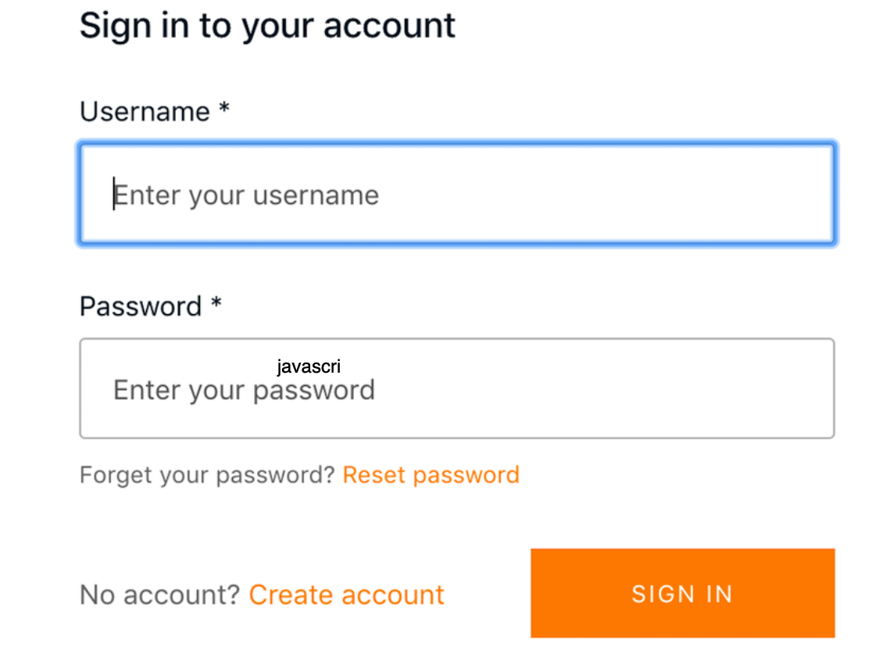

# Introduccion a FullStack Serverless con Amplify

## 1) Instalando y configurando amplify CLI

```
~ npm install -g @aws-amplify/cli
```

Luego de esto se debe configurar un usuario con el IAM de la cuenta que tenemos de AWS para esto.

Para crear un nuevo usuario y configurar el CLI ejecutamos el siguiente comando:

```
~ amplify configure
```

> 1. Specify the AWS region.
> > Aqui colocamos la region de nuestra preferencia.
> 2. Specify the username.
> >  En este punto se recomienda colocar un nombre representativo que de informacion referencial cuando se vea, ej. *miempresa-cli-app* o *usuario-amplify-app*.

Una vez se ingresa el nombre del usuario se abre por lo general el navegador por default y nos lleva al dashboard de AWS IAM, a partir de aqui se seleccionan las opciones por default.


## 2) Inicializando la aplicacion

```
~ npx create-react-app amplify-app
```

Despues de crear la aplicacion React debemos cambiar al directorio generado

```
~ cd amplify-app
```

Ahora debemos instalar Amplify, para eso debemos utilizar las librerias propias de AWS Amplify y AWS Amplify React para los componentes especificos de IU:

```
~ npm install aws-amplify @aws-amplify/ui-react
```

Ahora creamos el proyecto Amplify

```
~ amplify init
```

> 1. Ingresamos el nombre del proyecto.
> 2. Ingresamos el ambiente (dev).
> 3. Nuestro IDE preferido (default).
> 4. Tipo de apliacion (JavaScript).
> 5. Framework de JavaScript (React).
> 6. Directorio del codigo fuente (src).
> 7. Directorio donde estara el codigo final (build).
> 8. Especificar el comando para compilar (npm run-script build).
> 9. Comando para iniciar (npm run-script start).
> 10. Eleccion del perfil de AWS (Y) y elegimos el que creamos previamente.

## 3) Creando y desplegando el primer servicio

```
~ amplify add auth
```

> 1. Configuracion de autenticacion y seguridad (default).
> 2. Como queremos que se logeen los usuarios (Username).
> 3. Configurar opciones avanzadas (No, I am done).

Para desplegar el servicio de autenticacion ejecutamos lo siguiente:

```
~ amplify push
```

Seleccionamos (Y).

En el archivo *src/index.js* agregamos lo siguiente:

```javascript
import Amplify from 'aws-amplify'
import config from './aws-exports'
Amplify.configure(config)
```

luego reemplazamos el codigo en *src/App.js* con lo siguiente:

```javascript
import React from 'react'
import { withAuthenticator, AmplifySignOut } from '@aws-amplify/ui-react'
        function App() {
            return (
                 <div>
                 <h1>Hola Unifaydesde AWS Amplify!<h1>
                    <AmplifySignOut >
                </div>
                )
}
export default withAuthenticator(App)
```

Luego iniciamos la aplicacion

```
~ npm start
```

Al iniciar todo deberiamos ver una pantalla como la siguiente:



## 4) Eliminando todos los recursos creados

Si queremos eliminar el componente de manera individual ejecutamos lo siguiente:
```
~ amplify remove auth
```
Si queremos eliminar todo el proyecto Amplify ejecutamos lo siguiente:

```
~ amplify delete
```


