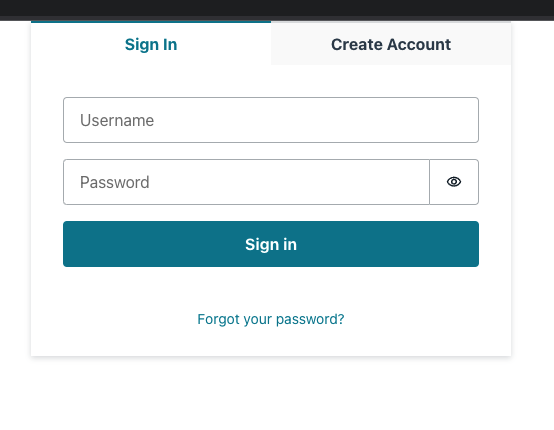

# Introduccion a FullStack Serverless con Amplify

## 1) Instalando y configurando amplify CLI

```
~ npm install -g @aws-amplify/cli
```

Luego de esto se debe configurar un usuario con el IAM de la cuenta que tenemos de AWS para esto.

Para crear un nuevo usuario y configurar el CLI ejecutamos el siguiente comando:

```
~ amplify configure
```

> 1. Specify the AWS region.
> > Aqui colocamos la region de nuestra preferencia.
> 2. Specify the username.
> >  En este punto se recomienda colocar un nombre representativo que de informacion referencial cuando se vea, ej. *miempresa-cli-app* o *usuario-amplify-app*.

Una vez se ingresa el nombre del usuario se abre por lo general el navegador por default y nos lleva al dashboard de AWS IAM, a partir de aqui se seleccionan las opciones por default.


<br>

Se agrega el accessKeyId desde el CSV que se descargo previamente:

<br>

## 2) Inicializando la aplicacion

```
~ npx create-react-app amplify-app
```

Es posible que se necesite instalar `create-react-app` Despues de crear la aplicacion React debemos cambiar al directorio generado:

```
~ cd amplify-app
```

Adicionalmente podemos ejecutar el siguiente comando para validar que el proyecto funciona correctamente:

```
~npm start
```
<!-- Descomentar la siguientes lineas pero antes se debe redimiencionar la imagen -->
<!-- `Esto deberia abrir automaticamente el navegador y se deplegara la app similar a esto:` -->

<!--  -->

Ahora debemos instalar Amplify, para eso debemos utilizar las librerias propias de AWS Amplify y AWS Amplify React para los componentes especificos de IU:

```
~ npm install aws-amplify @aws-amplify/ui-react
```

Ahora creamos el proyecto Amplify

```
~ amplify init
```

Luego seleccionamos las siguientes opciones:


<br>

## 3) Creando y desplegando el primer servicio

```
~ amplify add auth
```


<br>

Para desplegar el servicio de autenticacion ejecutamos lo siguiente:

```
~ amplify push
```


Seleccionamos (Y) y `podemos irnos a tomar un cafecito mientras se despliega todo...`

En el archivo *src/index.js* agregamos lo siguiente:

```javascript
import Amplify from 'aws-amplify'
import config from './aws-exports'
Amplify.configure(config)
```

luego reemplazamos el codigo en *src/App.js* con lo siguiente:

```javascript
import { Amplify } from 'aws-amplify';
import { Authenticator } from '@aws-amplify/ui-react';
import '@aws-amplify/ui-react/styles.css';
import awsExports from './aws-exports';
Amplify.configure(awsExports);

export default function App() {
  return (
    <Authenticator>
      {({ signOut, user }) => (
        <main>
          <h1>Hello {user.username}</h1>
          <button onClick={signOut}>Sign out</button>
        </main>
      )}
    </Authenticator>
  );
}
```

Luego iniciamos la aplicacion

```
~ npm start
```

Al iniciar todo deberiamos ver una pantalla como la siguiente:



Una vez se ingresa deberiamos ver algo como lo siguiente pero con el nombre del usuario que se registro previamente:


<br>

## 4) Eliminando todos los recursos creados

Si queremos eliminar el componente de manera individual ejecutamos lo siguiente:
```
~ amplify remove auth
```
Si queremos eliminar todo el proyecto Amplify ejecutamos lo siguiente:

```
~ amplify delete
```

<br>

> ### Referencias bibliograficas
>> https://ui.docs.amplify.aws/components/authenticator


